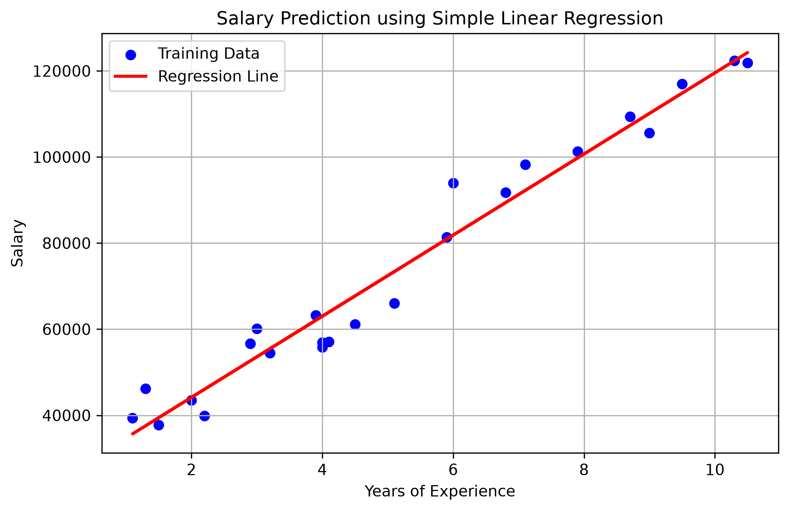

# Salary Prediction using Simple Linear Regression

A Machine Learning project that predicts employee salaries based on years of experience using **Simple Linear Regression**. This project demonstrates the complete ML workflow, from data preprocessing to model evaluation and visualization.

---

##  Project Overview

The goal of this project is to build a Simple Linear Regression model that predicts an employee's salary based on their years of experience.

This project covers:
- Data loading and exploration
- Exploratory Data Analysis (EDA)
- Data preprocessing
- Train-test split
- Model training
- Model evaluation
- Data visualization

---

## Dataset

**Dataset:** Salary_Data.csv

| Feature | Description |
|----------|-------------|
| YearsExperience | Number of years of work experience |
| Salary | Employee salary |

- Number of records: **30**
- Missing values: **None**

---

##  Tech Stack

- Python
- NumPy
- Pandas
- Matplotlib
- Scikit-learn
- Jupyter Notebook
- Git & GitHub

---

##  Project Structure

```
salary-prediction-linear-regression/
│
├── data/
│   └── Salary_Data.csv
│
├── images/
│   └── regression_line.png
│
├── notebooks/
│   └── salary_prediction.ipynb
│
├── requirements.txt
├── README.md
├── LICENSE
└── .gitignore
```

---

##  Machine Learning Workflow

1. Import required libraries
2. Load the dataset
3. Explore the dataset
4. Check for missing values
5. Perform Exploratory Data Analysis (EDA)
6. Select features and target variable
7. Split data into training and testing sets
8. Train the Linear Regression model
9. Make predictions
10. Evaluate the model
11. Visualize the regression line

---

##  Model Performance

| Metric | Value |
|--------|-------:|
| Mean Absolute Error (MAE) | 6286.45 |
| Mean Squared Error (MSE) | 49,830,096.86 |
| Root Mean Squared Error (RMSE) | 7059.04 |
| R² Score | **0.9024** |

### Interpretation

The model achieved an **R² score of 0.9024**, indicating that approximately **90% of the variation in salary** is explained by years of experience.

---

## 📷 Visualization

### Regression Line



---

##  Installation

Clone the repository:

```bash
git clone https://github.com/roshanisingh-dev/salary-prediction-linear-regression.git
```

Move into the project directory:

```bash
cd salary-prediction-linear-regression
```

Create a virtual environment:

```bash
python -m venv .venv
```

Activate the virtual environment:

**Windows**

```bash
.\.venv\Scripts\Activate
```

Install dependencies:

```bash
pip install -r requirements.txt
```

Launch Jupyter Notebook:

```bash
jupyter notebook
```

---

##  How to Run

1. Open the notebook `notebooks/salary_prediction.ipynb`
2. Run all cells sequentially.
3. Observe the evaluation metrics.
4. View the regression line visualization.

---

##  What I Learned

- Data loading using Pandas
- Data exploration and EDA
- Handling features and target variables
- Train-Test Split
- Building a Simple Linear Regression model
- Model evaluation using MAE, MSE, RMSE, and R² Score
- Visualizing predictions using Matplotlib
- Version control using Git and GitHub

---

##  Future Improvements

- Multiple Linear Regression
- Polynomial Regression
- Feature Engineering
- Model Deployment using Streamlit
- Interactive salary prediction interface

---

## License

This project is licensed under the **MIT License**.

---

##  Author

**Roshani Singh**

B.Tech Computer Science & Engineering Student

 Currently learning:
- Machine Learning
- Deep Learning
- Natural Language Processing
- Data Structures & Algorithms

GitHub: https://github.com/roshanisingh-dev

---

 If you found this project helpful, consider giving it a star!